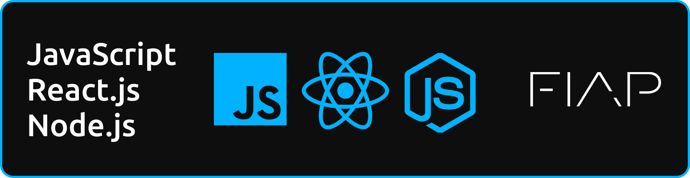

# CRIADOR
- **[Kaique Rodrigues Zaffarani](https://github.com/Z4ffarani)**

<br>

# INTRODUÇÃO
O Desenvolvimento Web é uma disciplina essencial na construção de sites e aplicações interativas que conectam pessoas e empresas em um ambiente digital. Ele envolve a criação de páginas dinâmicas e interativas, utilizando uma variedade de tecnologias e linguagens de programação, tanto no Front-end quanto no Back-end.

O Desenvolvimento Web pode ser dividido em três áreas principais: Front-end, Back-end e Banco de Dados. Cada área desempenha um papel importante na criação de uma aplicação web funcional, segura e escalável. O Front-end lida com a interface do usuário, o Back-end processa a lógica de negócios e a comunicação com o servidor, enquanto o Banco de Dados gerencia o armazenamento e a recuperação dos dados.

<br>

# FUNDAMENTOS
- **HTML, CSS e JavaScript** | A base do desenvolvimento Front-end. O HTML estrutura o conteúdo, o CSS define o estilo visual e o JavaScript adiciona interatividade e dinamismo às páginas web. Juntos, eles criam a experiência visual e interativa que os usuários têm ao navegar em um site.

- **Back-end Development** | Envolve a criação da lógica do servidor, a gestão de requisições, e o processamento de dados. Linguagens como **[Node.js](https://nodejs.org)**, **[Python](https://www.python.org)** com **[Django](https://www.djangoproject.com)**, **[Ruby](https://www.ruby-lang.org)** com **[Rails](https://rubyonrails.org)**, e **[PHP](https://www.php.net)** são amplamente usadas para construir o Back-end de aplicações web.

- **Banco de Dados** | Responsável pelo armazenamento e gestão dos dados. Bancos de Dados relacionais como **[MySQL](https://www.mysql.com)** e **[PostgreSQL](https://www.postgresql.org)**, assim como bancos de dados NoSQL como **[MongoDB](https://www.mongodb.com)**, são usados para armazenar informações de forma eficiente e estruturada.

- **APIs (Application Programming Interfaces)** | Facilitam a comunicação entre o Front-end e o Back-end, assim como a integração com serviços externos. Com APIs, é possível buscar dados de terceiros, como informações de clima ou redes sociais, e utilizá-los na aplicação.

<br>

# DESENVOLVIMENTO
- **Criação de Sites e Aplicações Interativas** | Utilizando HTML, CSS e JavaScript, é possível desenvolver sites e aplicações ricas em interatividade. Ferramentas e frameworks como **[React.js](https://react.dev)**, **[Vue.js](https://vuejs.org)** e **[Angular.js](https://angular.io)** ajudam a criar interfaces de usuário reativas e modulares.

- **Desenvolvimento de Servidores e APIs** | Com o uso de frameworks Back-end como **[Express.js](https://expressjs.com)** para Node.js, **[Django](https://www.djangoproject.com)** para Python, ou **[Spring Boot](https://spring.io/projects/spring-boot)** para Java, é possível construir servidores robustos que gerenciam a lógica de negócios e as requisições do cliente.

- **Integração de Banco de Dados** | A integração com Bancos de Dados é essencial para armazenar e gerenciar informações de usuários e transações. Ferramentas de ORM (Object-Relational Mapping) como **[Sequelize](https://sequelize.org)** para Node.js ou **[SQLAlchemy](https://www.sqlalchemy.org)** para Python facilitam essa integração, permitindo trabalhar com dados de forma mais intuitiva.

- **Deploy e Hospedagem** | O deploy de aplicações envolve a disponibilização do site ou aplicação em um servidor web. Serviços como **[Heroku](https://www.heroku.com)**, **[Netlify](https://www.netlify.com)**, e **[AWS](https://aws.amazon.com)** oferecem plataformas para hospedagem e gerenciamento de aplicações de forma escalável e segura.

- **Segurança e Autenticação** | A segurança é um aspecto fundamental do Desenvolvimento Web. Implementar autenticação segura com bibliotecas como **[JWT](https://jwt.io)**, proteção contra ataques de CSRF e XSS, e boas práticas de segurança no tratamento de dados são essenciais para proteger a aplicação e os usuários.

<br>

# VANTAGENS
- **Acessibilidade Global** | Com o Desenvolvimento Web, é possível criar aplicações acessíveis globalmente, alcançando uma audiência vasta e diversificada através da internet.

- **Interatividade e Dinamismo** | Ferramentas modernas permitem criar aplicações altamente interativas e responsivas, melhorando a experiência do usuário e a usabilidade.

- **Facilidade de Atualização e Manutenção** | Aplicações web podem ser atualizadas e mantidas de forma centralizada, sem a necessidade de atualizações manuais por parte dos usuários.

- **Escalabilidade** | Com serviços em nuvem e boas práticas de desenvolvimento, é possível escalar aplicações web de forma eficiente para suportar um grande número de usuários e requisições.

<br>

# CONCLUSÃO
O Desenvolvimento Web é uma área dinâmica e em constante evolução, que combina habilidades técnicas e criativas para construir aplicações poderosas e interativas. Com uma base sólida em Front-end, Back-end e Banco de dados, e utilizando as melhores práticas e ferramentas disponíveis, é possível criar soluções inovadoras e eficientes que atendem às necessidades dos usuários e empresas em todo o mundo.

<br>

# OBSERVAÇÕES
- Este projeto é uma coletânea de anotações e exemplos práticos desenvolvidos durante o estudo de Desenvolvimento Web. Inclui conceitos básicos e avançados, exemplos de código, boas práticas e exercícios resolvidos. O objetivo é organizar e consolidar o conhecimento adquirido, servindo como exemplo para desenvolvedores que desejam aprofundar suas habilidades em Desenvolvimento Web.

<br>

# INSTRUÇÕES
1. Em um terminal, clonar o repositório:
```bash
git clone https://github.com/Z4FFARANI-STUDY/WEB-DEVELOPMENT.git
```

2. Em um terminal, navegar até a pasta do projeto:
```bash
cd WEB-DEVELOPMENT
```

3. Acessar o conteúdo das aulas adiante da pasta `SEM1` ou `SEM2`.
